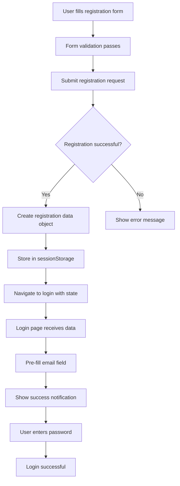

# 🔄 Enhanced Registration Flow Documentation

## Overview

Tính năng tự động chuyển từ trang đăng ký sang trang đăng nhập với thông tin được điền sẵn, tạo trải nghiệm người dùng mượt mà và thuận tiện.

## 🚀 Features

### ✅ **Automatic Redirect**
- Tự động chuyển hướng sau khi đăng ký thành công
- Không cần người dùng thao tác thêm
- Giữ nguyên context của session

### ✅ **Pre-filled Data**
- Email được điền sẵn từ thông tin đăng ký
- Username được lưu trữ để hiển thị
- Tên đầy đủ được ghép từ firstName + lastName

### ✅ **Success Notification**
- Thông báo chào mừng cá nhân hóa
- Animation mượt mà với gradient background
- Icon và styling chuyên nghiệp

### ✅ **Data Persistence**
- Sử dụng React Router state
- Fallback với sessionStorage
- Tự động cleanup sau khi sử dụng

## 📁 File Structure

```
src/
├── components/
│   └── atoms/
│       └── SuccessNotification.tsx    # Reusable success notification
├── pages/
│   ├── RegisterPage.tsx               # Updated registration flow
│   └── LoginPage.tsx                  # Enhanced login with pre-fill
└── REGISTRATION_FLOW.md               # This documentation
```

## 🔧 Implementation Details

### 1. Registration Success Handler

```tsx
// RegisterPage.tsx
const onSubmit = useCallback(async () => {
  const result = await dispatch(registerUser({
    username: formData.username,
    email: formData.email,
    password: formData.password,
    firstName: formData.firstName,
    lastName: formData.lastName
  }))

  if (registerUser.fulfilled.match(result)) {
    // Prepare data for login page
    const registrationData = {
      email: formData.email,
      username: formData.username,
      fullName: `${formData.firstName} ${formData.lastName}`.trim()
    }
    
    // Store in sessionStorage as fallback
    sessionStorage.setItem('registrationSuccess', JSON.stringify(registrationData))
    
    // Navigate with state
    navigate('/auth/login', { 
      state: { 
        fromRegistration: true,
        registrationData 
      }
    })
  }
}, [dispatch, formData, navigate])
```

### 2. Login Page Data Handling

```tsx
// LoginPage.tsx
// Check for registration data from multiple sources
const registrationData = location.state?.registrationData || 
  (() => {
    const stored = sessionStorage.getItem('registrationSuccess')
    if (stored) {
      sessionStorage.removeItem('registrationSuccess') // Cleanup
      return JSON.parse(stored)
    }
    return null
  })()

// Pre-fill form with registration email
const { formData, fields, ... } = useFormValidation(
  { 
    email: registrationData?.email || '', 
    password: '' 
  },
  // ... validation rules
)
```

### 3. Success Notification Component

```tsx
// SuccessNotification.tsx
interface SuccessNotificationProps {
  title: string
  message: string
  icon?: string
  onClose?: () => void
  autoClose?: boolean
  duration?: number
}

// Features:
// - Gradient background with animation
// - Auto-close with progress bar
// - Accessible with ARIA labels
// - Responsive design
```

## 🎨 UI/UX Enhancements

### Visual Design
- **Gradient Background**: Modern green gradient for success state
- **Smooth Animations**: Slide-in from top with ease-out timing
- **Typography Hierarchy**: Clear title and message distinction
- **Icon Integration**: Emoji icons for visual appeal

### Accessibility
- **ARIA Labels**: Proper labeling for screen readers
- **Keyboard Navigation**: Full keyboard accessibility
- **Color Contrast**: High contrast for readability
- **Focus Management**: Proper focus indicators

### Responsive Design
- **Mobile Friendly**: Optimized for all screen sizes
- **Touch Targets**: Appropriate button sizes
- **Spacing**: Consistent padding and margins

## 📊 Data Flow



## 🔒 Security Considerations

### Data Handling
- **Temporary Storage**: Data is cleaned up after use
- **No Sensitive Data**: Only email, username, and display name
- **Session Scoped**: Data expires with browser session

### Validation
- **Server-side Validation**: All data validated on backend
- **Client-side Sanitization**: Input sanitization before storage
- **Type Safety**: TypeScript ensures data integrity

## 🧪 Testing Scenarios

### Happy Path
1. ✅ User completes registration form
2. ✅ Registration succeeds
3. ✅ Automatic redirect to login
4. ✅ Email pre-filled correctly
5. ✅ Success notification displays
6. ✅ User can login immediately

### Edge Cases
1. ✅ Navigation state lost (fallback to sessionStorage)
2. ✅ SessionStorage cleared (graceful degradation)
3. ✅ Registration fails (no redirect)
4. ✅ Direct login access (no pre-fill)

### Error Handling
1. ✅ Network errors during registration
2. ✅ Invalid registration data
3. ✅ Browser storage disabled
4. ✅ JavaScript disabled (graceful degradation)

## 📱 Browser Compatibility

| Feature | Chrome | Firefox | Safari | Edge |
|---------|--------|---------|--------|------|
| React Router State | ✅ | ✅ | ✅ | ✅ |
| SessionStorage | ✅ | ✅ | ✅ | ✅ |
| CSS Animations | ✅ | ✅ | ✅ | ✅ |
| Gradient Backgrounds | ✅ | ✅ | ✅ | ✅ |

## 🚀 Performance Optimizations

### Code Splitting
- Components loaded only when needed
- Lazy loading for heavy components
- Tree shaking for unused code

### Memory Management
- Automatic cleanup of stored data
- Event listener cleanup
- Timer cleanup in useEffect

### Network Efficiency
- Minimal data transfer
- Efficient state management
- Optimized re-renders

## 🔮 Future Enhancements

### Planned Features
- [ ] **Email Verification Flow**: Integrate with email verification
- [ ] **Social Registration**: Pre-fill from social auth data
- [ ] **Multi-step Registration**: Progress preservation
- [ ] **Registration Analytics**: Track conversion rates

### UX Improvements
- [ ] **Progress Indicators**: Show registration progress
- [ ] **Onboarding Tour**: Guide new users
- [ ] **Personalization**: Customize based on user type
- [ ] **A/B Testing**: Test different flows

## 📞 Usage Examples

### Basic Implementation
```tsx
// In your registration success handler
const handleRegistrationSuccess = (userData) => {
  const registrationData = {
    email: userData.email,
    username: userData.username,
    fullName: userData.fullName
  }
  
  sessionStorage.setItem('registrationSuccess', JSON.stringify(registrationData))
  navigate('/auth/login', { state: { registrationData } })
}
```

### Custom Success Message
```tsx
// Custom notification
<SuccessNotification
  title="Welcome aboard!"
  message={`Hi ${userData.firstName}! Your account is ready.`}
  icon="🚀"
  autoClose={true}
  duration={3000}
/>
```

## 📝 Changelog

### v1.1.0 (Current)
- ✅ Automatic redirect after registration
- ✅ Pre-filled login form
- ✅ Success notification component
- ✅ Dual data persistence (state + storage)
- ✅ Enhanced UX with animations

### v1.0.0 (Previous)
- Basic registration form
- Manual navigation to login
- No data persistence
- Generic success messages
